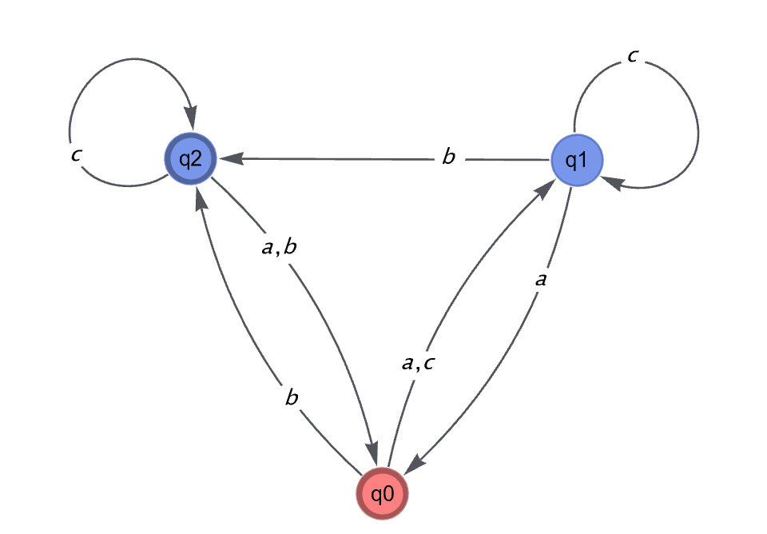

# RegularLanguages
Tools for specification, visualization, comparison, and manipulation of regular languages in Mathematica

## Usage

### DFAs
DFAs can be specified in one of two ways:

`DFA[states, initial, final]`, where
- `states` is a list of rules of the form
    ```Mathematica 
    {q1 -> {a -> δ[q1, a], b -> δ[q1, b], ...}, 
     q2 -> {a -> δ[q2, a], b -> δ[q2, b], ...}, ...}
    ```
    where `{q1, q2, ...}` are state names, `{a, b, ...}` are symbols of the alphabet, and `δ[q, x]` is the state transitioned to from `q` on symbol `x`.
- `initial` is a list containing the single initial state.
- `final` is a list of final states.

`DFA[rules, alphabet, initial, final]`, where 
- `rules` has the form
    ```Mathematica 
    {q1 -> {δ[q1, a], δ[q1, b],...}, 
     q2 -> {δ[q2, a], δ[q2, b],...}, ...}
    ```
- `alphabet` is an ordered list of symbols of the alphabet,
- `initial` is a list containing the single initial state.
- `final` is a list of final states.

Note that valid DFAs must define, `δ[q, x]` for all states `q` and alphabet symbols `x`. 

#### Example
```Mathematica 
(* The following are equivalent *)

DFA[{q0 -> {a -> q1, b -> q2, c -> q1}, 
     q1 -> {a -> q0, b -> q2, c -> q1}, 
     q2 -> {a -> q0, b -> q0, c -> q2}}, {q0}, {q0, q2}] // Graph

DFA[{q0 -> {q1, q2, q1}, 
     q1 -> {q0, q2, q1}, 
     q2 -> {q0, q0, q2}}, {a, b, c}, {q0}, {q0, q2}] // Graph
```



### NFAs
NFAs are specified 


### Regular Expressions
