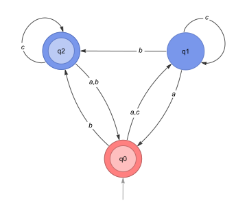
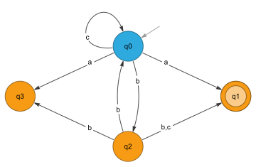
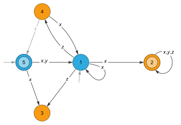

# RegularLanguages

Tools for specification, visualization, comparison, and manipulation of regular languages in Mathematica

# Installation
Evaluate in the *Mathematica* front end to download and install the paclet from this repository:
```wl
PacletInstall[
  "RegularLanguages",
  "Site" -> "http://raw.githubusercontent.com/adrsm108/RegularLanguages/main"
]
```

Once installed, the paclet can be loaded with
```wl
<< RegularLanguages`
```

Information about package symbols can be inspected using
```wl
? RegularLanguages`*
```

# Usage
## DFAs

A DFAs is specified `DFA[stateRules, {q0}, final]`, where

- `q0` is the initial state,
- `final` is a list of final states.
- `stateRules` is one of:
  - a list `{q -> {a -> q1, b -> q2, ...}, ...}`, where `q` is a state, `a, b,...` are symbols in the alphabet,
    and `q1, q2, ...` are the states reached from `q` by transition on `a, b, ...`, respectively.
  - The sequence `{q -> {q1, q2, ...}, ...}, {a, b, ...}`, where `q`, `a, b,...` and `q1, q2,...` are as before. Note
    that exactly one transition must be specified for each symbol for each state, so this is often a useful shorthand.

### Example

```wl
(* The following are equivalent *)

DFA[{q0 -> {a -> q1, b -> q2, c -> q1}, 
     q1 -> {a -> q0, b -> q2, c -> q1}, 
     q2 -> {a -> q0, b -> q0, c -> q2}}, {q0}, {q0, q2}] // Graph

DFA[{q0 -> {q1, q2, q1}, 
     q1 -> {q0, q2, q1}, 
     q2 -> {q0, q0, q2}}, {a, b, c}, {q0}, {q0, q2}] // Graph
```



### NFAs

An NFA is specified `NFA[stateRules, initial, final]`, where

- `initial` is a list of starting states
- `final` is a list of final states
- `stateRules` is a nested list of rules of the form ` {q -> {a -> {q1, q2, ...}, ...}, ...} `, where
  - `q` is a state,
  - `a` is a symbol in the alphabet, and
  - `{q1, q2, ...}` is the set of states reachable from `q` by transition on `a`.

Unlike DFAs, it is not necessary to specify transitions for every state and symbol in an NFA. If the rhs of the rule for
state *q* does not contain a key for symbol *x*, it assumed that *δ(q, x)* = ∅. If a rule or list of initial/final
states references some state *p*, but `stateRules` contains no entry for *p*, it is assumed *δ(q, x)* for every *x* in
the alphabet.

An *ε*-transition can be specified with the symbol `Epsilon`.

### Examples

```wl
NFA[{q0 -> {"a" -> {q1, q3}, "b" -> {q2}, "c" -> {q0}},
     q2 -> {"b" -> {q0, q1, q3}, "c" -> {q1}}},
  {q0}, {q1}] // Graph
```



```wl
NFA[{1 -> {x -> {1, 2}, z -> {3, 4}}, 
     2 -> {x -> {2}, y -> {2}, z -> {2}}, 
     4 -> {x -> {1}, Epsilon -> {5}}, 
     5 -> {x -> {1, 3}, y -> {1}}}, 
  {1, 5}, {2, 5}] // Graph
```



## Regular Expressions

Regular expressions are represented symbolically by the operations [REUnion](#REUnion), [REConcat](#REConcat),
and [REClosure](#REClosure).

A Regular expression may be created from a string using the [ParseRE](#ParseRE) function.
The recognized constructs are infix-`|` for union, postfix-`*` for closure, juxtaposition for concatenation, `(` and `)` for grouping, and `\ ` for escaping the next special character.
All other characters are parsed as literals.


```wl
In[1] = ParseRE["(a|b*)de*"]

Out[80] = REConcat[REUnion["a", REClosure["b"]], "d", REClosure["e"]]
```

## Running a Finite Automaton

DFA and NFA objects can be called with a list of symbols representing a string, and will return True or False, depending
on whether the machine is in one of its final states after consuming the input. Calling a finite automaton on a string
literal is equivalent to calling it on the list of characters in that string literal.

All finite automata can be made to return a list of state names in the transition sequence for a particular input by passing a sequence specification as the second argument.

### Examples

Consider the following DFA recognizing the language `a*b*`:


```wl
In[21]:= (* A DFA recognizing the language a*b* *)
dfa = DFA[{0 -> {0, 1}, 
           1 -> {2, 1}, 
           2 -> {2, 2}}, {"a", "b"}, {0}, {0, 1}];

In[22]:= dfa["abb"] (* Equivalent to dfa[{"a","b", "b"}] *)

Out[22]= True

In[23]:= dfa["b"]

Out[23]= True

In[24]:= dfa[""]

Out[24]= True

In[25]:= dfa["ba"]

Out[25]= False

In[26]:= dfa["aaabb", All] (* Return all states in the transition sequence *)

Out[26]= {0, 0, 0, 0, 1, 1}

In[27]:= dfa["abaaa", {2, 4}] (* Returns states 2 through 4 in the transition sequence *)

Out[27]= {0, 1, 2}
``` 

Consider the following NFA for the same language `a*b*`


```wl
In[28]:= nfa = NFA[{0 -> {"a" -> {0}, Epsilon -> {1}}, 
                    1 -> {"b" -> {1}}}, {0}, {0, 1}]; (* An NFA recognizing a*b* *)

In[29]:= nfa["abb"]

Out[29]= True

In[30]:= nfa["ba"]

Out[30]= False

nfa["aaabb", All] (* Transition sequences for NFAs consist of subsets of states *)

Out[31]= {{0, 1}, {0, 1}, {0, 1}, {0, 1}, {1}, {1}}

In[32]:= nfa["aabbba", All]

Out[32]= {{0, 1}, {0, 1}, {0, 1}, {1}, {1}, {1}, {}}
```


## Visualization

#### Finite automata
NFAs and DFAs can be visualized by passing them to one of the built-in functions `Graph` or `Graph3D`, along with any of
the usual options these functions accept. A graph created this way satisfies `FAQ`, and can be used directly with any
function expecting an NFA or DFA. Calling `NFA` or `DFA` on the graph returns the original automaton, as does the
function `FAExpression`.

#### Regular expressions
By default, regular expressions alias the system symbols `VerticalSeparator`, `CenterDot`, and `SuperStar` to `REUnion`, `REConcat`, and `REClosure`, respectively.
These symbols have no default meaning, but format automatically, and allow for natural input.
See [UseNotation](#usenotation) for more information.

# Package Symbols

### AddTransitions
**Attributes:** Protected
- **AddTransitions[nfastate, a &rarr; {q1, q2, &hellip;}]** returns an [NFAState](#NFAState) s where s[a] = Union[nfastate[a], {q1, q2, &hellip;}]
- **AddTransitions[nfastate, {a1 &rarr; {q1, q2, &hellip;}, &hellip;}]** returns an [NFAState](#NFAState) with the specified transitions added.
- **AddTransitions[rules]** returns an operator form of AddTransitions. 

### AdvancedSimplifyRE
**Attributes:** Protected
- **AdvancedSimplifyRE[r]** applies additional techniques of factorization and regular language equivalence to simplify the given regular expression.

**Options:** "Factorize"


### CompoundREQ
**Attributes:** Protected
- **CompoundREQ[expr]** returns True if expr has head [REUnion](#REUnion), [REConcat](#REConcat), or [REClosure](#REClosure).
- **CompoundREQ[expr, patt]** returns True if expr is a compound regex and every character in the standard alphabet of regex matches patt.

### DecimalFactorDFA
**Attributes:** Protected
- **DecimalFactorDFA[n]** returns a DFA accepting lists of digits whose decimal value is divisible by n
- **DecimalFactorDFA[n, True]** returns a DFA accepting lists of digits whose decimal value is divisible by n, as well as the empty list.

### DeleteUnreachableStates
**Attributes:** Protected
- **DeleteUnreachableStates[A]** returns an automaton whose state set is exactly [TransitiveClosure](#TransitiveClosure)[A]

### DFA
**Attributes:** Protected
- The head DFA represents a Deterministic Finite Automaton.
- **DFA[{q1 &rarr; t1, q2 &rarr; t2 , &hellip;}, {q0}, {r1, r2, &hellip;}]** specifies a DFA with states q1, q2, &hellip;, initial state q0, and final states r1, r2, &hellip;,where each ti is a list of transition rules {a1 &rarr; s1, a2 &rarr; s2, &hellip;} specifying exactly one state s for each symbol a of the alphabet.
- **DFA[{q1 &rarr; {s1, s2, &hellip;}, &hellip;}, {a1, a2, &hellip;}, &hellip;]** is an alternate form for the above. Here, transitions are given as lists of states, and the alphabet is supplied as a second argument.
- **DFA[&hellip;][{a1, a2, a3, &hellip;}]** returns True if the given DFA accepts the string of symbols a1 a2 a3&hellip;
- **DFA[&hellip;][symbs, All]** returns the sequence of transitions on the given symbols as a list of states.
- **DFA[&hellip;][symbs, spec]** returns a subset of the transition sequence, where spec is any sequence specification.
- **DFA[&hellip;][string, &hellip;]** is equivalent to DFA[&hellip;][Characters[string], &hellip;]

### DFAQ
**Attributes:** Protected
- **DFAQ[x]** returns True if x is a valid DFA.

### DFAState
**Attributes:** Protected
- **DFAState[q, <|a1 &rarr; q1, a2 &rarr; q2, &hellip;|>]** represents the nonterminal state with ID q in a DFA with transitions δ(q, ai) = qi.
  - Keys[DFAState[q, trns]] is equivalent to Keys[trns].
  - Values[DFAState[q, trns]] is equivalent to Values[trns].
- **DFAState[q, δ, True]** represents a terminal state.
- **DFAState[q, δ, {init, term}]** represents a state which is initial if init is True, and terminal if term is True.
- **DFAState[q, &hellip;][a]** gives the transition δ(q, a)

### EmptyFAQ
**Attributes:** Protected
- **EmptyFAQ[A]** returns True if A is an automaton whose language an empty set.

### EmptyLanguage
**Attributes:** Protected
- **EmptyLanguage** is a symbol representing the language with no elements. In various contexts, it can be viewed as the empty set, an automaton with no reachable accepting states, the regular expression matching nothing, etc.

### EntireFAQ
**Attributes:** Protected
- **EntireFAQ[A]** yields True if A is an automaton which accepts all strings over its alphabet.

### Epsilon
**Attributes:** Protected
- **Epsilon** is a symbol representing the string of length 0.

### EpsilonClosure
**Attributes:** Protected
- **EpsilonClosure[A]** computes the epsilon closure (that is, the transitive closure over the empty string) of the initial states in the Automaton A.
- **EpsilonClosure[q, A]** gives the epsilon closure of state q in A.
- **EpsilonClosure[{q1, q2, &hellip;}, A]** gives EpsilonClosure[q1, A] ⋃ EpsilonClosure[q2, A] ⋃ &hellip;
- **EpsilonClosure[states, transitions]** finds the epsilon closure of states in transitions, where transitions can be any transition specification recognized by [TransitiveClosure](#TransitiveClosure). 

### EquivalentFAQ
**Attributes:** Protected
- **EquivalentFAQ[A1, A2]** is True if A1 and A2 are automata that recognize the same language.
- **EquivalentFAQ[A1, A2, &hellip;]** yields true if all Ai are equivalent automata.
- **EquivalentFAQ[A]** yields true if A is an automaton.

### ExpandRE
**Attributes:** Protected
- **ExpandRE[r]** expands the given regular expression by distributing [REConcat](#REConcat) over [REUnion](#REUnion).

### FAClosure
**Attributes:** Protected
- **FAClosure[A]** returns an NFA for the closure of the language recognized by A with respect to concatenation.

### FAComplement
**Attributes:** Protected
- **FAComplement[A]** returns a DFA recognizing the complement of the language recognized by A.

### FAConcat
**Attributes:** Protected
- **FAConcat[A1, A2, &hellip;]** gives an NFA accepting the concatenation of the languages recognized by the Ai.

### FactorRE
**Attributes:** Protected
- **FactorRE[r]** attempts to factor the given regular expression.

### FAExpression
**Attributes:** Protected
- **FAExpression[A]** returns A as an automaton with head NFA or DFA.

### FAExpressionQ
**Attributes:** Protected
- **FAExpressionQ[A]** returns True if A is a valid Automaton with head NFA or DFA.

### FAGraphQ
**Attributes:** Protected
- **FAGraphQ[G]** yields True if G is a graph with a valid "Automaton" annotation.

### FAIntersection
**Attributes:** Protected
- **FAIntersection[A1, A2, &hellip;]** returns a DFA for the intersection of the languages recognized by the Ai.

### FAQ
**Attributes:** Protected
- **FAQ[A]** yields True if A is a valid representation of a finite automaton.

### FAReversal
**Attributes:** Protected
- **FAReversal[A]** returns an NFA recognizing the reversal of the language recognized by A.

### FASymmetricDifference
**Attributes:** Protected
- **FASymmetricDifference[A1, A2]** returns a DFA for the symmetric difference of the languages recognized by A1 and A2.

### FAType
**Attributes:** Protected
- **FAType[A]** returns NFA if A is an NFA, or DFA if A is a DFA.

### FAUnion
**Attributes:** Protected
- **FAUnion[A1, A2, &hellip;]** returns a DFA for the union of the languages recognized by the Ai.

### IDs
**Attributes:** Listable, Protected
- **IDs[A]** returns a list of state names for the DFA or NFA A.
- **IDs[A, prop]** gives the IDs for states with property prop.
  - Valid properties include: "Initial", "Terminal", and "Nonterminal".
- **IDs[A, "Index"]** returns an association of state ids and their indices: <|id1 &rarr; 1, id2 &rarr; 2 &hellip;|>.

### IndexFA
**Attributes:** Protected
- **IndexFA[A]** returns an automaton isomorphic to A, where the ID of each state is its index.

### InitialQ
**Attributes:** Protected
- **InitialQ[state]** returns True if state is initial.

### LanguageAlphabet
**Attributes:** Protected
- **LanguageAlphabet[*L*]** returns the alphabet of the language represented by *L*, where *L* can be any automaton or regex.
  - For an automaton *A*, this is the union of the set of transition characters (which may include the empty string) over all states in *A*.
  - For a regular expression *r*, this is the set of all characters in *r*, where a character is defined to be any subexpression *expr* of *r* such that
      1. neither *expr* nor Head[*expr*] is one of [REUnion](#REUnion), [REConcat](#REConcat), [REClosure](#REClosure), [Regex](#Regex), or [EmptyLanguage](#EmptyLanguage) and
      2. *expr* is not descended from any expression satisfying the previous rule.

**Options:** "IncludeEpsilon"
- **"IncludeEpsilon"** &rarr; True | False | Automatic, *default: Automatic*    
  - *True:* the returned list always includes [Epsilon](#Epsilon).
  - *False:* the returned list never includes [Epsilon](#Epsilon).
  - *Automatic:* the returned list only includes [Epsilon](#Epsilon) when the language contains explicit [Epsilon](#Epsilon)-productions.

### LinearizeRE
**Attributes:** Protected
- **LinearizeRE[regex]** linearizes regex by indexing each character occurrence.
- **LinearizeRE[regex, i]** linearizes regex by indexing each character occurrence, starting at i.
- **LinearizeRE[regex, i, True]** returns a list {r', {a1, a2, &hellip;}} where r' is the linearization of regex, and the ai are the alphabet of r'

### LoadNotation
**Attributes:** Protected
- **LoadNotation[]** can be evaluated to add the following extra notational forms for the RegularLanguages package:
  - [REUnion](#REUnion)[*a*, *b*, &hellip;] formats as *a* | *b* | &hellip; (\\[VerticalSeparator], alias `Esc`|`Esc`). VerticalSeparator is redefined to reference [REUnion](#REUnion).
  - [REConcat](#REConcat)[*a*, *b*, &hellip;] formats as a · b · &hellip; (\\[CenterDot], alias `Esc`.`Esc`). CenterDot is redefined to reference [REConcat](#REConcat).
  - [REClosure](#REClosure)[*a*] formats as *a** (SuperStar[*a*], shortcut Ctrl + ^, * ). SuperStar is redefined to reference [REClosure](#REClosure).
  - [Epsilon](#Epsilon) formats as ε, (\\[CurlyEpsilon], alias `Esc`ce`Esc`) and ε will be set to [Epsilon](#Epsilon) if it is not yet defined.
  - [EmptyLanguage](#EmptyLanguage) formats as ∅ (\\[EmptySet], alias `Esc`es`Esc`), and ∅ will be set to [EmptyLanguage](#EmptyLanguage) if it is not yet defined.
- **LoadNotation[]** is evaluated by default upon package load
  - To disable this, set RegularLanguages\`[UseNotation](#UseNotation) = False before loading package.
- [UnloadNotation](#UnloadNotation)[] removes all extra definitions and formatting rules.

### MinimizeDFA
**Attributes:** Protected
- **MinimizeDFA[dfa]** returns an equivalent DFA with the minimum number of states.

**Options:** "StateNames"
- **"StateNames"** &rarr; "Indexed" | "Subset" | "SubsetUnion", *default: "Indexed"*    
  - *"Indexed":* The state ids of the new automaton are positive integers.
  - *"Subset":* State ids are subsets of the ids of the original, representing equivalence classes in its [StatesPartition](#StatesPartition).
  - *"SubsetUnion":* Like "Subset", but state ids are the unions of elements of subsets instead of the subsets themselves.
    - Useful when the state ids of the original automaton are themselves lists.

### MinimizeNFA
**Attributes:** Protected
- **MinimizeNFA[nfa]** attempts to find an equivalent NFA with fewer states than the original.
- If a NFA with fewer states is not found, the original is returned.

**Options:** Method, MaxIterations
- **Method** &rarr; "Exhaustive" | "SimulatedAnnealing" | Automatic, *default: Automatic*    
  The method to use for minimization.
  - *"Exhaustive":* Deterministic, exhaustive search.
    - State count of a Returned NFA is guarenteed to be minimal
    - The poor scaling of this algorithm renders it unsuitable for all but the simplest inputs.
  - *"SimulatedAnnealing":* Probabilistic local search based on simulated annealing.
    - Heuristic optimization suitable for small to medium NFAs.
    - Non-deterministic. In general, obtaining the same result on different runs is not to be expected
  - *Automatic:* Choose a suitable method automatically based on the number of prime grids identified.


- **MaxIterations** &rarr; _Integer?Positive, *default: 250*    
  Maximum number of annealing steps to perform before returning when Method &rarr; "SimulatedAnnealing".

### NFA
**Attributes:** Protected
- The head NFA represents a nondeterministic finite automaton.
- **NFA[{q1 &rarr; t1, q2 &rarr; t2, &hellip;}, {q01, q02, &hellip;}, {r1, r2, &hellip;}]** specifies an NFA with states q1, q2, &hellip; initial states q01, q02, &hellip;, final states r1, r2, &hellip;, where each ti is a list of transitions {a1 &rarr; {s11, s12, &hellip;}, a2 &rarr; {s21, s22, &hellip;}, &hellip;}, with keys that are symbols in the alphabet, and values which are lists of states.
  - Not all transitions must be explicitly specified; for any symbol u for which no transition is given from state q, it is assumed δ(q, u) = { }.
  - Not all states must be explicitly specified; states without keys are assumed to have empty transition sets for all symbols.
- **NFA[&hellip;][{a1, a2, a3, &hellip;}]** returns True if the given NFA accepts the string of symbols a1 a2 a3&hellip;
- **NFA[&hellip;][symbs, All]** returns the sequence of transitions on the given symbols as a list of sets of states.
- **NFA[&hellip;][symbs, spec]** returns a subset of the transition sequence, where spec is any sequence specification.

### NFAQ
**Attributes:** Protected
- **NFAQ[A]** yields True if A is a valid NFA.

### NFAState
**Attributes:** Protected
- **NFAState[q, <|a &rarr; {q1, q2 &hellip;}, &hellip;|>]** represents the nonterminal state q in an NFA with transitions δ(q, a) = {q1, q2, &hellip;}.
  - Keys[NFAState[q, trns]] is equivalent to Keys[trns].
  - Values[NFAState[q, trns]] is equivalent to Values[trns].
- **NFAState[q, δ, True]** represents a terminal state.
- **NFAState[q, δ, {init, term}]** represents a state which is initial if init is True, and terminal if term is True.
- **NFAState[q, &hellip;][a]** gives the transition δ(q, a). 

### NthFromLastNFA
**Attributes:** Protected
- **NthFromLastNFA[n]** returns an NFA accepting the language of strings over {"a", "b"} whose n-th from last character is "a"
- **NthFromLastNFA[n, c, {c1, c2, &hellip;}]** returns an NFA accepting the language of strings over {c1, c2, &hellip;} whose n-th from last character is c.

### ParseRE
**Attributes:** Protected
- **ParseRE[str]** converts a regex in string form to an expression in terms of [REUnion](#REUnion), [REConcat](#REConcat), and [REClosure](#REClosure).
- Recognized constructs are (from greatest to least precedence)
  - Prefix "\\" escapes the next character.
  - Round parentheses "(" and ")" indicate grouping.
  - Postfix "*" is parsed as closure.
  - Juxtaposition is interpreted as concatenation.
  - Infix "|" is parsed as union.
- All other characters are interpreted as string literals of length 1.

**Options:** "FullParseTree"
- **"FullParseTree"** &rarr; True | False, *default: False*    
  - *False:* Result expression will use [REUnion](#REUnion), [REConcat](#REConcat), and [REClosure](#REClosure) as heads, which automatically reorder and simplify terms.
  - *True:* Result expression will use Inactive[[REUnion](#REUnion)], Inactive[[REConcat](#REConcat)], and Inactive[[REClosure](#REClosure)].
    - The active form can be recovered by calling Activate on the returned expression.

### RandomDFA
**Attributes:** Protected
- **RandomDFA[n,k]** gives a random DFA with n states on an alphabet of k symbols.

**Options:** "TerminalStates", "AlphabetFunction", "StatesFunction", "AllStatesReachable"


### RandomNFA
**Attributes:** Protected
- **RandomNFA[{*states*&hellip;},{*symbols*&hellip;}]** creates a random NFA with states {* &hellip;states &hellip;* &hellip;} and alphabet {* &hellip;symbols &hellip;* &hellip;}.
- **RandomNFA[*n*,*k*]** creates a random NFA with *n* states on an alphabet of *k* symbols.
  - Either *n* or *k* can be a list, as in the above case.
  - Default state ids are 1, 2, &hellip;, *n*
  - Default symbols are "a", "b", &hellip; (ascii character range 97 to 97 + k) if k ≤ 26, or "x1", "x2", &hellip;, "xk" otherwise.
  - When a function *f* is provided for the "StatesFunction" option, the state ids will be Array[*f*, *n*]
  - When a function *g* is provided for the "AlphabetFunction" option, the alphabet will be Array[*g*, *k*].
- **RandomNFA[&hellip;,*max<sub>*n*</sub>*,*max<sub>*k*</sub>*]** specifies each state of the returned NFA should transition to no more than *max<sub>*n*</sub>* states on any one symbol, and define transitions for no more than *max<sub>*k*</sub>* symbols.
  - Non-integer values given for *max<sub>*n*</sub>* and *max<sub>*k*</sub>* are interpreted as factors of *n* and *k* respectively.

**Options:** "EpsilonProbability", "TerminalStates", "InitialStates", "AllStatesReachable", "AlphabetFunction", "StatesFunction"
- **"InitialStates"** &rarr; _Integer | _?NumericQ, *default: 1*    
  Number of initial states in the returned NFA
  - **n*_Integer:* *n* initial states.
  - **x*_?NumericQ:* Ceiling[*x* *n*] initial states, where *n* is the total number of states.


- **"TerminalStates"** &rarr; _Integer | _?NumericQ, *default: 0.3*    
  Number of terminal states in the returned NFA
  - **n*_Integer:* *n* terminal states.
  - **x*_?NumericQ:* Ceiling[*x* *n*] terminal states, where *n* is the total number of states.


- **"StatesFunction"** &rarr; _, *default: Automatic*    
  Function to generate state names, applied to the list of states or Range[*n*]


- **"AlphabetFunction"** &rarr; _, *default: Automatic*    
  Function to generate alphabet symbols, applied to the list of symbols or Range[*k*]


- **"AllStatesReachable"** &rarr; True | False, *default: True*    
  Whether the returned NFA must form a (weakly) connected graph.


- **"EpsilonProbability"** &rarr; _?(Between[{0, 1}]), *default: 0.01*    
  The probability of a given state generating an [Epsilon](#Epsilon)-transition.

### RandomRE
**Attributes:** Protected
- **RandomRE[n, k]** returns a random regular expression on n symbols from an alphabet of length k.
- **RandomRE[n,k,p]** returns a random regular expression of n symbols from an alphabet of length k, where p is the probability of grouping.

**Options:** "ClosureProbability", "UnionProbability", TimeConstraint, "AlphabetFunction", "EpsilonProbability"


### REClosure
**Attributes:** Protected
- **REClosure[e]** represents a regex matching the closure of expression e with respect to concatenation. This is defined as the set {[Epsilon](#Epsilon), e, ee, eee, &hellip;}.

### REConcat
**Attributes:** Flat, OneIdentity, Protected
- **REConcat[e1, e2, &hellip;]** represents a regex matching the concatenation e1 e2 &hellip; of the expressions ei.

### Regex
**Attributes:** Protected
- **Regex[x]** represents the regular expression whose language is exactly {x}.
- Used to indicate a literal outside a compound RE.

### ReindexFA
**Attributes:** Protected
- **ReindexFA[A]** returns an automaton similar to A, but whose states are renamed with positive integers according to the order each is visited in a depth-first search from the initial states. By default, the returned automaton includes only those states which are reachable from the initial.
- **ReindexFA[A, True]** returns the same, but also keeps disconnected components. The resulting automaton is isomorphic to A.

### RELength
**Attributes:** Protected
- **RELength[regex]** gives the number of characters in the regular expression regex. Note that the character [Epsilon](#Epsilon) is considered to have length 0.

### REMatchQ
**Attributes:** Protected
- **REMatchQ[expr, regex]** returns True if expr is matched by regex.
- **REMatchQ[regex]** represents an operator form of REMatchQ.

### RenameStates
**Attributes:** Protected
- **RenameStates[A, f]** returns an automaton isomorphic to A, with states {f[q1], f[q2], &hellip;}, where {q1, q2, &hellip;} are the states of A.

### RENormal
**Attributes:** Protected
- **RENormal[regex]** converts the regex into an expression with head RegularExpression recognizing strings from the same language.

### REQ
**Attributes:** Protected
- **REQ[expr]** yields True when expr has head [Regex](#Regex), or satisfies [CompoundREQ](#CompoundREQ).
- **REQ[expr, patt]** gives True if expr is [EmptyLanguage](#EmptyLanguage) or [Epsilon](#Epsilon), or of the form [Regex](#Regex)[x] where x matches patt, or is a compound regex where every subexpression at level -1 that is not [EmptyLanguage](#EmptyLanguage) or [Epsilon](#Epsilon) matches patt.

### RESymbolIndex
**Attributes:** Protected
- **RESymbolIndex[r, i]** is a symbolic wrapper representing the i-th occurrence of the symbol r in a linearized regex.

### REUnion
**Attributes:** Flat, OneIdentity, Orderless, Protected
- **REUnion[e1, e2, &hellip;]** represents a regex matching the union e1 | e2 | &hellip; of the expressions ei.

### SameAlphabetQ
**Attributes:** Protected
- **SameAlphabetQ[*A<sub>1</sub>*,*A<sub>2</sub>*,&hellip;]** returns true if [LanguageAlphabet](#LanguageAlphabet)[*A<sub>1</sub>*], [LanguageAlphabet](#LanguageAlphabet)[*A<sub>2</sub>*], &hellip; are equivalent as sets.

### SameLanguageQ
**Attributes:** Protected
- **SameLanguageQ[*L<sub>1</sub>*,*L<sub>2</sub>*,&hellip;]** returns True if all *L<sub>*i*</sub>* are automata or regular expressions that describe the same language.

### SetInitial
**Attributes:** Protected
- **SetInitial[state, bool]** returns a copy of state with the property that [InitialQ](#InitialQ)[SetInitial[state, bool]] = bool.
- **SetInitial[bool]** is an operator form of SetInitial that can be applied to states.

### SetTerminal
**Attributes:** Protected
- **SetTerminal[state, bool]** returns a copy of state with the property that [TerminalQ](#TerminalQ)[SetTerminal[state, bool]] = bool.
- **SetTerminal[bool]** is an operator form of SetTerminal that can be applied to states.

### SimplifyRE
**Attributes:** Protected
- **SimplifyRE[r]** attempts to simplify the provided regular expression using simple pattern matching.

### StateCount
**Attributes:** Listable, Protected
- **StateCount[A]** returns the number of states in the automaton A.
- **StateCount[A, prop]** returns the number of states in A with property prop.
  - Valid properties include: "Initial", "Terminal", and "Nonterminal".

### StateID
**Attributes:** Listable, Protected
- **StateID[q]** returns the id of q, where q is an expression with head [NFAState](#NFAState) or [DFAState](#DFAState).

### StateQ
**Attributes:** Protected
- **StateQ[expr]** returns True if expr has head [NFAState](#NFAState) or [DFAState](#DFAState)

### States
**Attributes:** Listable, Protected
- **States[A]** returns an association <|id &rarr; state, &hellip;|> of all states in the DFA or NFA A.
- **States[A, "Values"]** returns a list {state1, state2, &hellip;} of all states in the DFA or NFA A.
- **States[A, prop]** returns an association <|id &rarr; state, &hellip;|> of states with the property prop.
  - Valid properties include  "Initial", "Terminal", and "Nonterminal".
- **States[A, prop, "Values"]** returns a list of states with the property prop.

### StatesPartition
**Attributes:** Protected
- **StatesPartition[dfa]** returns a list of partition blocks for the states of dfa according to the equivalence: p ~ q iff for all words w over the alphabet, reading w starting from state p ends in an accepting state exactly when the same is true starting from q.

### StateSuccessors
**Attributes:** Protected
- **StateSuccessors[q]** returns a list of [IDs](#IDs) comprising the set of states to which q has an outgoing transition.
- **StateSuccessors[q, {a1, a2, &hellip;}]** returns the set of states to which q has an outgoing transition on one of the symbols ai.

### SubsetFAQ
**Attributes:** Protected
- **SubsetFAQ[A1, A2]** returns True if the language recognized by automaton A1 is a subset of the language recognized by automaton A2.
- **SubsetFAQ[A, A1, A2, &hellip;]** yields True if SubsetFAQ[A, Ai] is true for all Ai.
- **SubsetFAQ[A]** represents an operator form of SubsetFAQ that can be applied to an expression.

### SubsetLanguageQ
**Attributes:** Protected
- **SubsetLanguageQ[*L<sub>1</sub>*,*L<sub>2</sub>*]** yields True if the language recognized by automaton or regular expression *L<sub>1</sub>* is a subset of the language recognized by *L<sub>2</sub>*.
- **SubsetLanguageQ[*L*,*L<sub>1</sub>*,*L<sub>2</sub>*,&hellip;]** returns True if SubsetLanguageQ[*L*, *L<sub>*i*</sub>*] is True for all *L<sub>*i*</sub>*.
- **SubsetLanguageQ[*L*]** represents an operator form of SubsetLanguageQ that can be applied to an expression.

### TerminalQ
**Attributes:** Protected
- **TerminalQ[state]** gives True if state is a terminal dfa or nfa state.

### ToDFA
**Attributes:** Protected
- **ToDFA[dfa]** returns the given DFA.
- **ToDFA[nfa]** converts an NFA into an equivalent DFA.
- **ToDFA[nfa, alphabet]** converts an NFA into an equivalent DFA with the given [LanguageAlphabet](#LanguageAlphabet).
- **ToDFA[regex]** converts a regular expression into a DFA by way of an intermediate NFA.

**Options:** Method, "StateNames"
- **Method** &rarr; Automatic | "Minimal", *default: Automatic*    
  - *"Minimal":* Returned DFA will have minimal states. Equivalent to calling [MinimizeDFA](#MinimizeDFA) on the result.
  - *Automatic:* Use the subset method for NFAs and regexes.


- **"StateNames"** &rarr; "Index" | "Subset", *default: "Index"*    
  - *"Index":* Returned dfa has states with integer ids that correspond to their index in [States](#States)[dfa].
  - *"Subset":* state ids correspond to subsets of the original set of states.
    - When constructed from an NFA with Method &rarr; "Automatic", these are the states from the subset method.

### ToNFA
**Attributes:** Protected
- **ToNFA[A]** converts the automaton A into an NFA.
- **ToNFA[regex]** converts the regular expression regex into an NFA.

**Options:** Method
- **Method** &rarr; "Glushkov" | "Thompson", *default: "Glushkov"*    
  The algorithm to use when converting a regular expression to an NFA.
  - *"Glushkov":* Glushkov construction
    - Results in an Epsilon-free NFA with n + 1 states, where n is the number of symbols in the original regular expression.
  - *"Thompson":* Thompson construction

### ToRE
**Attributes:** Protected
- **ToRE[A]** converts the automaton A to an equivalent regular expression.

**Options:** Method


### Transitions
**Attributes:** Protected
- **Transitions[dfastate]** gives the transition table for a dfa state as the association <|a1 &rarr; q1, &hellip;|>, where ai is a character in the input alphabet, and qi is the id of δ(dfastate, ai)].
- **Transitions[nfastate]** gives the transition table for an nfa state as the association <|a1 &rarr; listi, &hellip;|>, where ai is a character in the input alphabet, and listi is the list {q1, q2, &hellip;} of state ids corresponding to δ(nfastate, ai)].
- **Transitions[q, spec&hellip;]** is equivalent to Lookup[Transitions[q], spec&hellip;] if q is an explicit DFA or NFA state.
- **Transitions[{q1, q2, &hellip;}, spec&hellip;]** is equivalent to Lookup[{Transitions[q1], Transitions[q2], &hellip;}, spec&hellip;], provided all qi have head [NFAState](#NFAState), or all qi have head [DFAState](#DFAState).

### TransitiveClosure
**Attributes:** Protected
- **TransitiveClosure[q, A]** returns the transitive closure of state q in automaton A.
- **TransitiveClosure[{q1, q2, &hellip;}, A]** returns the union (TransitiveClosure[q2,A] ⋃ TransitiveClosure[q2, A] ⋃ &hellip;)
- **TransitiveClosure[A]** returns the transitive closure of the initial states of automaton A.
- **TransitiveClosure[states, transitions]** returns the transitive closure of the given states according to the given transition specifications. The parameter transitions should be an association or list of rules of the form q &rarr; t, where q is a state id, and t is the transition table for q as an association or list of rules.
- **TransitiveClosure[&hellip;, {a1, a2, &hellip;}]** gives the transitive closure over the set of symbols a1, a2, &hellip;

### UnloadNotation
**Attributes:** Protected
- **UnloadNotation[]** removes the extra notational forms for the RegularLanguages package introduced by [LoadNotation](#LoadNotation).

### UseNotation
- **UseNotation** is a flag that controls whether [LoadNotation](#LoadNotation)[] will be called on package load.

### VisualizeFA
**Attributes:** Protected
- **VisualizeFA[*A*,*opts*&hellip;]** produces a Graph of the automaton *A* with options * &hellip;opts &hellip;* &hellip;.
  - This is equivalent to Graph[*A*, * &hellip;opts &hellip;* &hellip;].
  - In addition to the following options, * &hellip;opts &hellip;* &hellip; can contain options to Graph.

**Options:** "EdgeTagWrapper", "InitialVertexRules", "TerminalVertexRules", "EpsilonEdgeRules", "InitialStateArrows", "InitialArrowEdgeRules", VertexLabels, EdgeLabels
- **"InitialVertexRules"** &rarr; _, *default: Automatic*    
  List of annotation rules applied to the vertices of initial states.


- **"TerminalVertexRules"** &rarr; _, *default: Automatic*    
  List of annotation rules applied to the vertices of terminal states.


- **"EpsilonEdgeRules"** &rarr; _, *default: Automatic*    
  List of annotation rules applied to edges representing [Epsilon](#Epsilon)-transitions.


- **"InitialStateArrows"** &rarr; True | False, *default: True*    
  Whether initial states should be drawn with an extra incoming arrow.


- **"InitialArrowEdgeRules"** &rarr; _, *default: Automatic*    
  List of annotation rules applied to the incoming arrows on initial states.

# References 
[Tsyganov, Andrey. (2012). Local Search Heuristics for NFA State Minimization Problem. Int'l J. of Communications,
Network and System Sciences. 05. 638-643. 10.4236/ijcns.2012.529074.](https://www.researchgate.net/publication/272672491_Local_Search_Heuristics_for_NFA_State_Minimization_Problem)

[Kameda, Tiko & Weiner, Peter. (1970). On the State Minimization of Nondeterministic Finite Automata. Computers, IEEE Transactions on. 100. 617 - 627. 10.1109/T-C.1970.222994. ](https://www.researchgate.net/publication/3045459_On_the_State_Minimization_of_Nondeterministic_Finite_Automata)

[Han, Yo-Sub & Wood, Derick. (2007). Obtaining shorter regular expressions from finite-state automata. Theoretical Computer Science. 370. 110-120. 10.1016/j.tcs.2006.09.025.](https://www.researchgate.net/publication/222648275_Obtaining_shorter_regular_expressions_from_finite-state_automata) 

[Allauzen, Cyril & Mohri, Mehryar. (2006). A Unified Construction of the Glushkov, Follow, and Antimirov Automata. 110-121. 10.1007/11821069_10.](https://www.researchgate.net/publication/220975761_A_Unified_Construction_of_the_Glushkov_Follow_and_Antimirov_Automata)