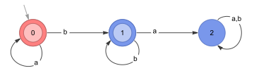

# RegularLanguages

Tools for specification, visualization, comparison, and manipulation of regular languages in Mathematica

# Installation
Evaluate in the *Mathematica* front end to download and install the paclet from this repository:
```wl
PacletInstall[
  "RegularLanguages",
  "Site" -> "http://raw.githubusercontent.com/adrsm108/RegularLanguages/main"
]
```

Once installed, the paclet can be loaded with
```wl
<< RegularLanguages`
```

Information about package symbols can be inspected using
```wl
? RegularLanguages`*
```

# Usage
## DFAs

A DFAs is specified `DFA[stateRules, {q0}, final]`, where

- `q0` is the initial state,
- `final` is a list of final states.
- `stateRules` is one of:
  - a list `{q -> {a -> q1, b -> q2, ...}, ...}`, where `q` is a state, `a, b,...` are symbols in the alphabet,
    and `q1, q2, ...` are the states reached from `q` by transition on `a, b, ...`, respectively.
  - The sequence `{q -> {q1, q2, ...}, ...}, {a, b, ...}`, where `q`, `a, b,...` and `q1, q2,...` are as before. Note
    that exactly one transition must be specified for each symbol for each state, so this is often a useful shorthand.

### Example

```wl
(* The following are equivalent *)

DFA[{q0 -> {a -> q1, b -> q2, c -> q1}, 
     q1 -> {a -> q0, b -> q2, c -> q1}, 
     q2 -> {a -> q0, b -> q0, c -> q2}}, {q0}, {q0, q2}] // Graph

DFA[{q0 -> {q1, q2, q1}, 
     q1 -> {q0, q2, q1}, 
     q2 -> {q0, q0, q2}}, {a, b, c}, {q0}, {q0, q2}] // Graph
```


### NFAs

An NFA is specified `NFA[stateRules, initial, final]`, where

- `initial` is a list of starting states
- `final` is a list of final states
- `stateRules` is a nested list of rules of the form ` {q -> {a -> {q1, q2, ...}, ...}, ...} `, where
  - `q` is a state,
  - `a` is a symbol in the alphabet, and
  - `{q1, q2, ...}` is the set of states reachable from `q` by transition on `a`.

Unlike DFAs, it is not necessary to specify transitions for every state and symbol in an NFA. If the rhs of the rule for
state *q* does not contain a key for symbol *x*, it assumed that *δ(q, x)* = ∅. If a rule or list of initial/final
states references some state *p*, but `stateRules` contains no entry for *p*, it is assumed *δ(q, x)* for every *x* in
the alphabet.

An *ε*-transition can be specified with the symbol `Epsilon`.

### Examples

```wl
NFA[{q0 -> {"a" -> {q1, q3}, "b" -> {q2}, "c" -> {q0}},
     q2 -> {"b" -> {q0, q1, q3}, "c" -> {q1}}},
  {q0}, {q1}] // Graph
```


```wl
NFA[{1 -> {x -> {1, 2}, z -> {3, 4}}, 
     2 -> {x -> {2}, y -> {2}, z -> {2}}, 
     4 -> {x -> {1}, Epsilon -> {5}}, 
     5 -> {x -> {1, 3}, y -> {1}}}, 
  {1, 5}, {2, 5}] // Graph
```


## Regular Expressions

Regular expressions are represented symbolically by the operations [REUnion](#REUnion), [REConcat](#REConcat),
and [REStar](#REStar).

A Regular expression may be created from a string using the [ParseRE](#ParseRE) function.
The recognized constructs are infix-`|` for union, postfix-`*` for closure, juxtaposition for concatenation, `(` and `)` for grouping, and `\ ` for escaping the next special character.
All other characters are parsed as literals.


```wl
In[1] = ParseRE["(a|b*)de*"]

Out[80] = REConcat[REUnion["a", REStar["b"]], "d", REStar["e"]]
```

## Running a Finite Automaton

DFA and NFA objects can be called with a list of symbols representing a string, and will return True or False, depending
on whether the machine is in one of its final states after consuming the input. Calling a finite automaton on a string
literal is equivalent to calling it on the list of characters in that string literal.

All finite automata can be made to return a list of state names in the transition sequence for a particular input by passing a sequence specification as the second argument.

### Examples

Consider the following DFA recognizing the language `a*b*`:



```wl
In[21]:= (* A DFA recognizing the language a*b* *)
dfa = DFA[{0 -> {0, 1}, 
           1 -> {2, 1}, 
           2 -> {2, 2}}, {"a", "b"}, {0}, {0, 1}];

In[22]:= dfa["abb"] (* Equivalent to dfa[{"a","b", "b"}] *)

Out[22]= True

In[23]:= dfa["b"]

Out[23]= True

In[24]:= dfa[""]

Out[24]= True

In[25]:= dfa["ba"]

Out[25]= False

In[26]:= dfa["aaabb", All] (* Return all states in the transition sequence *)

Out[26]= {0, 0, 0, 0, 1, 1}

In[27]:= dfa["abaaa", {2, 4}] (* Returns states 2 through 4 in the transition sequence *)

Out[27]= {0, 1, 2}
``` 

Consider the following NFA for the same language `a*b*`


```wl
In[28]:= nfa = NFA[{0 -> {"a" -> {0}, Epsilon -> {1}}, 
                    1 -> {"b" -> {1}}}, {0}, {0, 1}]; (* An NFA recognizing a*b* *)

In[29]:= nfa["abb"]

Out[29]= True

In[30]:= nfa["ba"]

Out[30]= False

nfa["aaabb", All] (* Transition sequences for NFAs consist of subsets of states *)

Out[31]= {{0, 1}, {0, 1}, {0, 1}, {0, 1}, {1}, {1}}

In[32]:= nfa["aabbba", All]

Out[32]= {{0, 1}, {0, 1}, {0, 1}, {1}, {1}, {1}, {}}
```


## Visualization

#### Finite automata
NFAs and DFAs can be visualized by passing them to one of the built-in functions `Graph` or `Graph3D`, along with any of
the usual options these functions accept. A graph created this way satisfies `FAQ`, and can be used directly with any
function expecting an NFA or DFA. Calling `NFA` or `DFA` on the graph returns the original automaton, as does the
function `FAExpression`.

#### Regular expressions
By default, regular expressions alias the system symbols `VerticalSeparator`, `CenterDot`, and `SuperStar` to `REUnion`, `REConcat`, and `REStar`, respectively.
These symbols have no default meaning, but format automatically, and allow for natural input.
See [UseNotation](#usenotation) for more information.

# Package Symbols

### ActivateRE
**Attributes:** Protected, ReadProtected
- **ActivateRE[*regex*]** removes Inactive from the heads [REUnion](#REUnion), [REConcat](#REConcat), and [REStar](#REStar) in *regex*.

### CompleteNFA
**Attributes:** Protected, ReadProtected
- **CompleteNFA[*nfa*]** returns an equivalent NFA with one extra state and non-empty transition sets for every alphabet symbol in every state.

### CompoundREQ
**Attributes:** Protected, ReadProtected
- **CompoundREQ[*expr*]** returns True if *expr* has head [REUnion](#REUnion), [REConcat](#REConcat), or [REStar](#REStar).
- **CompoundREQ[*expr*, *patt*]** returns True if *expr* has head [REUnion](#REUnion), [REConcat](#REConcat), or [REStar](#REStar), and every element of [LanguageAlphabet](#LanguageAlphabet)[*expr*] matches *patt*.

### CreateUniqueState
**Attributes:** Protected, ReadProtected
- **CreateUniqueState[]** is equivalent to CreateUUID["state-"].
- **CreateUniqueState[*A*]** returns an integer, string, or symbol suitable for use as a state name in the automaton *A*.
  - The returned name attempts to follow the naming conventions of *A*
  - If every state in *A* is an integer, the generated name will be the integer one greater than the maximum state name in *A*.
  - If every state in *A* is a string, the generated name will be a string.
  - If every state in *A* is a symbol, the generated name will be a symbol.
  - If no simple convention is identified, the generated name will be a string obtained using CreateUUID.
- **CreateUniqueState[&hellip;, *n*]** generates a list of *n* state names.

### DecimalFactorDFA
**Attributes:** Protected, ReadProtected
- **DecimalFactorDFA[*n*]** returns a DFA accepting lists of digits whose decimal value is divisible by *n*.
- **DecimalFactorDFA[*n*, True]** returns a DFA accepting lists of digits whose decimal value is divisible by *n*, as well as the empty list.

### DFA
**Attributes:** Protected, ReadProtected
- The head DFA represents a deterministic finite automaton.
- **DFA[{*q<sub>1</sub>* &rarr; {*a<sub>1</sub>* &rarr; *s<sub>1</sub>*, *a<sub>2</sub>* &rarr; *s<sub>2</sub>*, &hellip;}, &hellip;}, {*q<sub>*init*</sub>*}, {*terms*&hellip;}]** specifies a DFA with initial state *q<sub>*init*</sub>*, terminal states *terms*, and transitions {*q<sub>1</sub>*, *a<sub>1</sub>*} &rarr; *s<sub>1</sub>*, {*q<sub>1</sub>*, *a<sub>2</sub>*} &rarr; *s<sub>2</sub>*, &hellip;, where *q<sub>*i*</sub>* and *s<sub>*i*</sub>* are states, and *a<sub>*i*</sub>* are symbols of the alphabet.
- **DFA[{*q<sub>1</sub>* &rarr; {*s<sub>1</sub>*, *s<sub>2</sub>*, &hellip;}, &hellip;}, {*a<sub>1</sub>*, *a<sub>2</sub>*, &hellip;}, &hellip;]** is an alternate form for the above. Here, transitions are given as lists of states, and the alphabet is supplied as a second argument.
- *dfa*[{*a<sub>1</sub>*, *a<sub>2</sub>*, &hellip;}] returns True if the given DFA accepts the string *a<sub>1</sub>* *a<sub>2</sub>* &hellip;
- *dfa*["*string*"] is equivalent to *dfa*[Characters["*string*"]].

### DFAQ
**Attributes:** Protected, ReadProtected
- **DFAQ[*x*]** returns True if *x* is a valid DFA.

### EmptyLanguage
**Attributes:** Protected, ReadProtected
- **EmptyLanguage** is a symbol representing the language with no elements. In various contexts, it can be viewed as the empty set, an automaton with no reachable accepting states, the regular expression matching nothing, etc.

### EmptyLanguageQ
**Attributes:** Protected, ReadProtected
- **EmptyLanguageQ[*L*]** returns True if *L* is an automaton or regular expression whose language is the empty set.

### Epsilon
**Attributes:** Protected, ReadProtected
- **Epsilon** is a symbol representing the string of length 0.

### EpsilonClosure
**Attributes:** Protected, ReadProtected
- **EpsilonClosure[*q*, *nfa*]** gives the set of states reachable from *q* in *nfa* via any sequence of [Epsilon](#Epsilon) transitions.
- **EpsilonClosure[{*q<sub>1</sub>*, *q<sub>2</sub>*, &hellip;}, *nfa*]** gives EpsilonClosure[*q<sub>1</sub>*, *nfa*] ⋃ EpsilonClosure[*q<sub>2</sub>*, *nfa*] ⋃ &hellip;
- **EpsilonClosure[*nfa*]** gives EpsilonClosure[[States](#States)[*nfa*, "Initial"], *nfa*].
- **EpsilonClosure[*states*, *trns*]** computes the epsilon closure of *states* using transition table *trns*, which may be can be any transition specification recognized by [ReachableStates](#ReachableStates).

### EpsilonNFAQ
**Attributes:** Protected, ReadProtected
- **EpsilonNFAQ[*nfa*]** returns True if *nfa* is an NFA with [Epsilon](#Epsilon) transitions, and False otherwise.

### EquivalentFAQ
**Attributes:** Protected, ReadProtected
- **EquivalentFAQ[*A<sub>1</sub>*, *A<sub>2</sub>*]** is True if *A<sub>1</sub>* and *A<sub>2</sub>* are automata that recognize the same language.
- **EquivalentFAQ[*A<sub>1</sub>*, *A<sub>2</sub>*, &hellip;]** yields true if all *A<sub>*i*</sub>* are equivalent automata.
- **EquivalentFAQ[*A*]** yields true if *A* is an automaton.

### ExpandAllRE
**Attributes:** Protected, ReadProtected
- **ExpandAllRE[*regex*]** expands the given regular expression by distributing [REConcat](#REConcat) over [REUnion](#REUnion) at all levels.

### ExpandRE
**Attributes:** Protected, ReadProtected
- **ExpandRE[*regex*]** expands the given regular expression by distributing [REConcat](#REConcat) over [REUnion](#REUnion).

### FAClosure
**Attributes:** Protected, ReadProtected
- **FAClosure[*A*]** returns an NFA for the closure of the language of automaton *A* with respect to concatenation.

### FAComplement
**Attributes:** Protected, ReadProtected
- **FAComplement[*A*]** returns an automaton of the same type as *A* for the complement of the language of *A*.

### FAConcatenation
**Attributes:** Protected, ReadProtected
- **FAConcatenation[*A<sub>1</sub>*, *A<sub>2</sub>*, &hellip;]** gives an NFA accepting the concatenation of the languages of automata *A<sub>*i*</sub>*.

### FactorRE
**Attributes:** Protected, ReadProtected
- **FactorRE[*regex*]** attempts to factor the given regular expression by pulling [REConcat](#REConcat) from [REUnion](#REUnion).
- **FactorRE** is the inverse of [ExpandRE](#ExpandRE), with some qualifications
  - Regular expressions do not factor uniquely. Thus, FactorRE gives only one of potentially many factorizations.

**Options:** Method

- **Method** &rarr; "Greedy" | "Careful"   , *default: "Greedy"*    
  The method to use for factoring.
  - *"Greedy":* Return the first factorization found.
  - *"Careful":* Consider all possible factorizations, and select one which favors a shorter final expression.
     - This option is likely to be significantly more resource intensive.

### FADifference
**Attributes:** Protected, ReadProtected
- **FADifference[*A*, *B<sub>1</sub>*, *B<sub>2</sub>*, &hellip;]** returns an NFA for the language consisting of words accepted by *A* and not accepted by any of the automata *B<sub>*i*</sub>*.

### FAExpression
**Attributes:** Protected, ReadProtected
- **FAExpression[*A*]** returns automaton *A* as an expression with head NFA or DFA.

### FAExpressionQ
**Attributes:** Protected, ReadProtected
- **FAExpressionQ[*A*]** returns True if *A* is a valid automaton with head NFA or DFA.

### FAGraph
**Attributes:** Protected, ReadProtected
- **FAGraph[*A*, *opts*&hellip;]** produces a Graph of the automaton *A* with options *opts*.
  - *opts* can contain any option recognized by Graph.
  - This is equivalent to Graph[*A*, *opts*] when *A* satisfies [FAExpressionQ](#FAExpressionQ).

**Options:** "DisableStyling", "InitialVertexRules", "TerminalVertexRules", "InitialVertexStyle", "TerminalVertexStyle", "EpsilonEdgeStyle", "InitialArrows", "InitialArrowStyle", VertexLabels, EdgeLabels

- **"DisableStyling"** &rarr; True | False   , *default: False*    
  When True, the returned graph has no styling applied.


- **"InitialVertexStyle"** &rarr; _   , *default: Automatic*    
  Styles applied to initial state vertices


- **"InitialVertexRules"** &rarr; _   , *default: Automatic*    
  List of annotation rules applied to initial state vertices
  - Overrides "InitialVertexStyle" option in favor of VertexStyle rule.


- **"TerminalVertexStyle"** &rarr; _   , *default: Automatic*    
  Styles applied to terminal state vertices


- **"TerminalVertexRules"** &rarr; _   , *default: Automatic*    
  List of annotation rules applied to terminal state vertices
  - Overrides "TerminalVertexStyle" option in favor of VertexStyle rule.


- **"EpsilonEdgeStyle"** &rarr; _   , *default: Automatic*    
  Styles applied to edges representing [Epsilon](#Epsilon)-transitions


- **"InitialArrows"** &rarr; True | False | Automatic   , *default: Automatic*    
  Whether initial states should be drawn with an incoming arrow


- **"InitialArrowStyle"** &rarr; _   , *default: Automatic*    
  Styles applied to incoming arrows on initial states

### FAGraph3D
**Attributes:** Protected, ReadProtected
- **FAGraph3D[*A*, *opts*&hellip;]** produces a Graph3D of the automaton *A* with options *opts*.
  - *opts* can contain any option recognized by Graph3D.
  - This is equivalent to Graph3D[*A*, *opts*] when *A* satisfies [FAExpressionQ](#FAExpressionQ).
- **FAGraph3D** takes the same options as [FAGraph](#FAGraph).

**Options:** "InitialVertexRules", "TerminalVertexRules", "InitialVertexStyle", "TerminalVertexStyle", "EpsilonEdgeStyle", "InitialArrows", "InitialArrowStyle", VertexLabels, EdgeLabels


### FAGraphQ
**Attributes:** Protected, ReadProtected
- **FAGraphQ[*G*]** yields True if *G* is a graph with a valid "Automaton" annotation.

### FAIntersection
**Attributes:** Protected, ReadProtected
- **FAIntersection[*A<sub>1</sub>*, *A<sub>2</sub>*, &hellip;]** returns a DFA for the intersection of the languages of the automata *A<sub>*i*</sub>*.

### FAMatchQ
**Attributes:** Protected, ReadProtected
- **FAMatchQ[*A*, {*a<sub>1</sub>*, *a<sub>2</sub>*, &hellip;}]** returns True if the finite automaton *A* accepts the string of symbols *a<sub>1</sub>* *a<sub>2</sub>* &hellip;
- **FAMatchQ[*A*, "string"]** is equivalent to FAMatchQ[*A*, Characters["string"]]

### FAQ
**Attributes:** Protected, ReadProtected
- **FAQ[*A*]** yields True if *A* is a valid representation of an NFA or DFA.

### FAReversal
**Attributes:** Protected, ReadProtected
- **FAReversal[*A*]** returns an NFA recognizing the reversal of the language of automaton *A*.

### FASymmetricDifference
**Attributes:** Protected, ReadProtected
- **FASymmetricDifference[*A<sub>1</sub>*, *A<sub>2</sub>*]** returns a DFA for the symmetric difference of the languages of automata *A<sub>1</sub>* and *A<sub>2</sub>*.

### FAType
**Attributes:** Protected, ReadProtected
- **FAType[*A*]** returns DFA if *A* is a DFA, or NFA if *A* is an NFA.

### FAUnion
**Attributes:** Protected, ReadProtected
- **FAUnion[*A<sub>1</sub>*, *A<sub>2</sub>*, &hellip;]** returns a DFA for the union of the languages of the automata *A<sub>*i*</sub>*.

### FullSimplifyRE
**Attributes:** Protected, ReadProtected
- **FullSimplifyRE[*regex*]** attempts to simplify *regex* using pattern matching, along with more complex factorization and equivalence checking techniques.
- **FullSimplifyRE** accepts many of the same options as FullSimplify.

**Options:** ComplexityFunction, ExcludedForms

- **ComplexityFunction** &rarr; "PostfixLength" | "InfixLength" | "AlphabeticLength" | "ExtendedAlphabeticLength" | _   , *default: RELength*    
  Function used to determine expression complexity. This can be a function, or one of the following special values:
  - *"PostfixLength":* [RELength](#RELength) with Method &rarr; "Postfix"
  - *"InfixLength":* [RELength](#RELength) with Method &rarr; "Infix"
  - *"AlphabeticLength":* [RELength](#RELength) with Method &rarr; "Alphabetic"
  - *"ExtendedAlphabeticLength":* [RELength](#RELength) with Method &rarr; "ExtendedAlphabetic"

### InactivateRE
**Attributes:** HoldFirst, Protected, ReadProtected
- **InactivateRE[*regex*]** wraps the heads [REUnion](#REUnion), [REConcat](#REConcat), and [REStar](#REStar) in *regex* with Inactive.
  - The result is an inert regular expression that does not simplify automatically, but can still be used for most operations.

### LanguageAlphabet
**Attributes:** Listable, Protected, ReadProtected
- **LanguageAlphabet[*L*]** returns the alphabet of the language represented by *L*, where *L* can be any automaton or regex.
  - For an automaton *A*, this is the union of the set of transition characters (which may include the empty string) over all states in *A*.
  - For a regular expression *r*, this is the set of all characters in *r*, where a character is defined to be any subexpression *expr* of *r* such that
      1. neither *expr* nor Head[*expr*] is one of [REUnion](#REUnion), [REConcat](#REConcat), [REStar](#REStar), [RELiteral](#RELiteral), or [EmptyLanguage](#EmptyLanguage) and
      2. *expr* is not descended from any expression satisfying the previous rule.

**Options:** "IncludeEpsilon"

- **"IncludeEpsilon"** &rarr; True | False | Automatic   , *default: Automatic*    
  - *True:* the returned list always includes [Epsilon](#Epsilon).
  - *False:* the returned list never includes [Epsilon](#Epsilon).
  - *Automatic:* the returned list only includes [Epsilon](#Epsilon) when the language contains explicit [Epsilon](#Epsilon)-productions.

### LoadNotation
**Attributes:** Protected, ReadProtected
- **LoadNotation[]** can be evaluated to add the following extra notational forms for the RegularLanguages package:
  - [REUnion](#REUnion)[*a*, *b*, &hellip;] formats as *a* | *b* | &hellip; (\\[VerticalSeparator], alias `Esc`|`Esc`). VerticalSeparator is redefined to reference [REUnion](#REUnion).
  - [REConcat](#REConcat)[*a*, *b*, &hellip;] formats as a · b · &hellip; (\\[CenterDot], alias `Esc`.`Esc`). CenterDot is redefined to reference [REConcat](#REConcat).
  - [REStar](#REStar)[*a*] formats as *a** (SuperStar[*a*], shortcut Ctrl + ^, * ). SuperStar is redefined to reference [REStar](#REStar).
  - [Epsilon](#Epsilon) formats as ε, (\\[CurlyEpsilon], alias `Esc`ce`Esc`) and ε will be set to [Epsilon](#Epsilon) if it is not yet defined.
  - [EmptyLanguage](#EmptyLanguage) formats as ∅ (\\[EmptySet], alias `Esc`es`Esc`), and ∅ will be set to [EmptyLanguage](#EmptyLanguage) if it is not yet defined.
- **LoadNotation[]** is evaluated by default upon package load
  - To disable this, set RegularLanguages\`[UseNotation](#UseNotation) = False before loading package.
- [UnloadNotation](#UnloadNotation)[] removes all extra definitions and formatting rules.

### MapRE
**Attributes:** Protected, ReadProtected
- **MapRE[*f*, *regex*]** returns *regex* with *f* applied to each literal.
  - Literals are visited in the same order they appear in *regex*.
  - Literals are unwrapped from [RELiteral](#RELiteral) before transformation: [RELiteral](#RELiteral)[*lit*, &hellip;] &rarr; *f*[*lit*].
- **MapRE[*f*]** returns an operator form of MapRE that can be applied to regular expressions.

### MinimizeDFA
**Attributes:** Protected, ReadProtected
- **MinimizeDFA[*dfa*]** returns an equivalent DFA with the minimum number of states.

**Options:** "StateNames"

- **"StateNames"** &rarr; Automatic | "Subset" | "SubsetUnion"   , *default: Automatic*    
  - *Automatic:* The returned DFA has states 1, 2, &hellip;.
  - *"Subset":* [States](#States) are subsets of the ids of the original, representing equivalence classes in its [StatesPartition](#StatesPartition).
  - *"SubsetUnion":* Like "Subset", but states are the unions of elements of subsets instead of the subsets themselves.
     - Assumes the states of the original automaton are lists.

### MinimizeNFA
**Attributes:** Protected, ReadProtected
- **MinimizeNFA[*nfa*]** attempts to find an equivalent NFA with fewer states than the original.
  - If a NFA with fewer states is not fougd, the original is returned.

**Options:** Method, MaxIterations

- **Method** &rarr; "Exhaustive" | "SimulatedAnnealing" | Automatic   , *default: Automatic*    
  The method to use for minimization.
  - *"Exhaustive":* Deterministic, exhaustive search.
      - State count of a Returned NFA is guarenteed to be minimal
      - The poor scaling of this algorithm renders it unsuitable for all but the simplest inputs.
  - *"SimulatedAnnealing":* Probabilistic local search based on simulated annealing.
      - Heuristic optimization suitable for small to medium NFAs.
      - Non-deterministic. In general, obtaining the same result on different runs is not to be expected
  - *Automatic:* Choose a suitable method automatically based on the number of prime grids identified.


- **MaxIterations** &rarr; _Integer?Positive   , *default: 250*    
  Maximum number of annealing steps to perform before returning when Method &rarr; "SimulatedAnnealing".

### NFA
**Attributes:** Protected, ReadProtected
- The head NFA represents a nondeterministic finite automaton.
- **NFA[{*q<sub>1</sub>* &rarr; {*a<sub>1</sub>* &rarr; {*s<sub>11</sub>*, *s<sub>12</sub>*, &hellip;}, &hellip;}, &hellip;}, {*inits*&hellip;}, {*terms*&hellip;}]** specifies an NFA with initial states *inits*, terminal states *terms*, and transitions {*q<sub>1</sub>*, *a<sub>1</sub>*} &rarr; {*s<sub>11</sub>*, *s<sub>12</sub>*, &hellip;}, &hellip;, where *q<sub>*i*</sub>* and *s<sub>*ij*</sub>* are states, and *a<sub>*i*</sub>* are alphabet symbols.
  - Not all transitions must be explicitly specified; on any symbol *a* for which there is no key in *q* &rarr; {&hellip;}, it is assumed {*q*, *a*} &rarr; { }.
  - Not all states must be explicitly specified; states without keys are assumed to have empty transition sets for all symbols.
- *nfa*[{*a<sub>1</sub>*, *a<sub>2</sub>*, &hellip;}] returns True if the given NFA accepts the string of symbols *a<sub>1</sub>* *a<sub>2</sub>* &hellip;.
- *nfa*["*string*"] is equivalent to *nfa*[Characters["*string*"]]

### NFAQ
**Attributes:** Protected, ReadProtected
- **NFAQ[*A*]** yields True if *A* is a valid NFA.

### NthFromLastNFA
**Attributes:** Protected, ReadProtected
- **NthFromLastNFA[*n*]** returns an NFA accepting the language of strings over {"a", "b"} whose *n*-th from last element is "a".
- **NthFromLastNFA[*n*, *a*, {*symbs*&hellip;}]** returns an NFA accepting the language of strings over *symbs* whose *n*-th from last element is *a*.
  - The smallest equivalent DFA has 2^n states.

### ParseRE
**Attributes:** Protected, ReadProtected
- **ParseRE[str]** converts a regex in string form to an expression in terms of [REUnion](#REUnion), [REConcat](#REConcat), and [REStar](#REStar).
- Recognized constructs are (from greatest to least precedence)
  - Prefix "\\" escapes the next character.
  - Round parentheses "(" and ")" indicate grouping.
  - Postfix "*" is parsed as closure.
  - Juxtaposition is interpreted as concatenation.
  - Infix "|" is parsed as union.
- All other characters are interpreted as string literals.

**Options:** "InactiveHeads"

- **"InactiveHeads"** &rarr; True | False | Full   , *default: False*    
  - *False:* The parsed expression uses [REUnion](#REUnion), [REConcat](#REConcat), and [REStar](#REStar), which may reorder and simplify terms.
  - *True:* The parsed expression uses Inactive[[REUnion](#REUnion)], Inactive[[REConcat](#REConcat)], and Inactive[[REStar](#REStar)] as heads.
    - n-ary unions/concatenations and nested stars are flattened
    - An active [RELiteral](#RELiteral) can be obtained by calling Activate on the returned expression.
  - *Full:* The parsed expression uses Inactive[[REUnion](#REUnion)], Inactive[[REConcat](#REConcat)], and Inactive[[REStar](#REStar)] as heads, and union/concatenation are handled as binary operations.
    - Nested stars are not flattened.
    - n-ary unions/concatenations are nested with left-associativity.

### RandomDFA
**Attributes:** Protected, ReadProtected
- **RandomDFA[{*states*&hellip;}, {*symbols*&hellip;}]** creates a random DFA with states *states* and alphabet *symbols*.
- **RandomDFA[*n*, *k*]** creates a random DFA with *n* states on an alphabet of *k* symbols.
  - Either *n* or *k* can be a list, as in the above case.
  - Default state ids are 1, 2, &hellip;, *n*
  - Default symbols are "a", "b", &hellip; (ascii character range 97 to 97 + k) if *k* ≤ 26, or "x1", "x2", &hellip;, "xk" otherwise.
  - When a function *f* is provided for the "StatesFunction" option, the state ids will be Array[*f*, *n*].
  - When a function *g* is provided for the "AlphabetFunction" option, the alphabet will be Array[*g*, *k*].

**Options:** "TerminalStates", "InitialStates", "AlphabetFunction", "StatesFunction", "AllStatesReachable"

- **"InitialStates"** &rarr; {*q*_} | Automatic   , *default: Automatic*    
  Initial state of the returned DFA
  - *{*q*_}:* initial state *q*.
  - *Automatic:* Randomly selected initial state.


- **"TerminalStates"** &rarr; _Integer | _Real | _List   , *default: 0.3*    
  Terminal states in the returned DFA
  - **l*_List:* terminal states are exactly the states in *l*.
  - **m*_Integer:* *m* terminal states.
  - **x*_Real:* Ceiling[*xn*] terminal states, where *n* is the total number of states.


- **"StatesFunction"** &rarr; _   , *default: Automatic*    
  Function to generate state names, applied to the list of states or Range[*n*]


- **"AlphabetFunction"** &rarr; _   , *default: Automatic*    
  Function to generate alphabet symbols, applied to the list of symbols or Range[*k*]


- **"AllStatesReachable"** &rarr; True | False   , *default: True*    
  Whether the returned DFA must form a (weakly) connected graph.

### RandomNFA
**Attributes:** Protected, ReadProtected
- **RandomNFA[{*states*&hellip;}, {*symbols*&hellip;}]** creates a random NFA with states {* &hellip;states &hellip;* &hellip;} and alphabet {* &hellip;symbols &hellip;* &hellip;}.
- **RandomNFA[*n*, *k*]** creates a random NFA with *n* states on an alphabet of *k* symbols.
  - Either *n* or *k* can be a list, as in the above case.
  - Default state names are 1, 2, &hellip;, *n*
  - Default symbols are "a", "b", &hellip; (ascii character range 97 to 97 + k) if *k* ≤ 26, or "x1", "x2", &hellip;, "xk" otherwise.
  - When a function *f* is provided for the "StatesFunction" option, the state ids will be Array[*f*, *n*].
  - When a function *g* is provided for the "AlphabetFunction" option, the alphabet will be Array[*g*, *k*].
- **RandomNFA[&hellip;, *max<sub>*n*</sub>*, *max<sub>*k*</sub>*]** specifies each state of the returned NFA should transition to no more than *max<sub>*n*</sub>* states on any one symbol, and define transitions for no more than *max<sub>*k*</sub>* symbols.
  - Non-integer values given for *max<sub>*n*</sub>* and *max<sub>*k*</sub>* are interpreted as factors of *n* and *k* respectively.

**Options:** "EpsilonFrequency", "TerminalStates", "InitialStates", "AllStatesReachable", "AlphabetFunction", "StatesFunction"

- **"InitialStates"** &rarr; _Integer | _Real | _List   , *default: 1*    
  Initial states in the returned NFA
  - **l*_List:* initial states are exactly the states in *l*.
  - **m*_Integer:* *m* randomly selected initial states.
  - **x*_Real:* Ceiling[*xn*] randomly selected initial states, where *n* is the total number of states.


- **"TerminalStates"** &rarr; _Integer | _Real | _List   , *default: 0.3*    
  Terminal states in the returned NFA
  - **l*_List:* terminal states are exactly the states in *l*.
  - **m*_Integer:* *m* terminal states.
  - **x*_Real:* Ceiling[*xn*] terminal states, where *n* is the total number of states.


- **"StatesFunction"** &rarr; _   , *default: Automatic*    
  Function to generate state names, applied to the list of states or Range[*n*]


- **"AlphabetFunction"** &rarr; _   , *default: Automatic*    
  Function to generate alphabet symbols, applied to the list of symbols or Range[*k*]


- **"AllStatesReachable"** &rarr; True | False   , *default: True*    
  Whether the returned NFA must form a (weakly) connected graph.


- **"EpsilonFrequency"** &rarr; _?(Between[{0, 1}])   , *default: 0.1*    
  The frequency with which states contain [Epsilon](#Epsilon)-transitions.

### RandomRE
**Attributes:** Protected, ReadProtected
- **RandomRE[*n*, {*symbols*&hellip;}]** returns a random regular expression of length *n* on the given symbols.
- **RandomRE[*n*, *k*]** returns a random regular expression of length *n* on an alphabet of *k* symbols.
  - Default symbols are "a", "b", &hellip; (ascii character range 97 to 97 + k) if *k* ≤ 26, or "x1", "x2", &hellip;, "xk" otherwise.

**Options:** "EpsilonFrequency", "StarFrequency", "InactiveHeads", "AlphabetFunction"

- **"EpsilonFrequency"** &rarr; _?(Between[{0, 1}])   , *default: 0.01*    
  The frequency with which [Epsilon](#Epsilon) should appear as a child of [REUnion](#REUnion).


- **"StarFrequency"** &rarr; _?(Between[{0, 1}])   , *default: 0.5*    
  The frequency with which subexpressions should be wrapped in [REStar](#REStar).


- **"AlphabetFunction"** &rarr; _   , *default: Automatic*    
  Function to generate alphabet symbols, applied to {* &hellip;symbols &hellip;* &hellip;} or Range[*k*]


- **"InactiveHeads"** &rarr; True | False | Full   , *default: False*    
  - *False:* The generated expression uses heads [REUnion](#REUnion), [REConcat](#REConcat), and [REStar](#REStar).
    - These operators" may automatically simplify the generated expression, resulting in a length less than *n*.
  - *True:* The generated expression uses heads Inactive[[REUnion](#REUnion)], Inactive[[REConcat](#REConcat)], and Inactive[[REStar](#REStar)].
    - Length of generated expressions guarenteed to be exactly *n*.
    - Generated expressions have flat n-ary unions/concatenations, and no nested stars.
    - An active [RELiteral](#RELiteral) can be obtained by calling Activate on the returned expression.
  - *Full:* The parsed expression uses Inactive[[REUnion](#REUnion)], Inactive[[REConcat](#REConcat)], and Inactive[[REStar](#REStar)] as heads with strictly binary union/concatenation.
    - Generated expressions have nested binary unions/concatenations and arbitrarily nested stars.

### ReachableStates
**Attributes:** Protected, ReadProtected
- **ReachableStates[{*q*}, *A*]** returns the set of states reachable from state *q* in finite automaton *A* by any sequence of transitions.
- **ReachableStates[{*q<sub>1</sub>*, *q<sub>2</sub>*, &hellip;}, *A*]** returns ReachableStates[*q<sub>1</sub>*, *A*] ⋃ ReachableStates[*q<sub>2</sub>*, *A*] ⋃ &hellip;
- **ReachableStates[*A*]** returns the set of states reachable from the initial states of the finite automaton *A*.
- **ReachableStates[*states*, *trns*]** returns states reachable from $states according to the transitions *trns*.
  - *trns* can be a [TransitionFunction](#TransitionFunction), or a list or association with elements *q* &rarr; *trns<sub>*q*</sub>*, where *trn<sub>*q*</sub>* is an association or list of rules of the form *a* &rarr; *res* such that *res* is the result of transitioning from *q* on symbol *a*.
- **ReachableStates[&hellip;, {*a<sub>1</sub>*, *a<sub>2</sub>*, &hellip;}]** finds states reachable via any sequence of transitions restricted to the symbols *a<sub>1</sub>*, *a<sub>2</sub>*, &hellip;.

**Options:** "TransitionType"

- **"TransitionType"** &rarr; DFA | NFA | Automatic   , *default: Automatic*    
  Used to specify whether the entries in a transition table are states or sets of states. Automatically set when the input is a NFA or DFA.
  - *Automatic:* Assume nondeterministic transitions if entries in transition table are lists. This fails if state names are themselves lists.

### REConcat
**Attributes:** Flat, OneIdentity, Protected, ReadProtected
- **REConcat[*e<sub>1</sub>*, *e<sub>2</sub>*, &hellip;]** represents a regular expression for the concatenation of the expressions *e<sub>*i*</sub>*.
  - Matches the language *L*[*e<sub>1</sub>*]*L*[*e<sub>2</sub>*]&hellip;, where *L*[*e<sub>*i*</sub>*] denotes the language of *e<sub>*i*</sub>*.
- *e<sub>1</sub>* · *e<sub>2</sub>* · *e<sub>3</sub>* · &hellip; is equivalent to REConcat[*e<sub>1</sub>*, *e<sub>2</sub>*, &hellip;] when extended notation is enabled.
  - Aliases CenterDot, which is a system symbol with built-in formatting but no default meaning.
  - Use \\[CenterDot] operator (alias `Esc`.`Esc`) for infix input.
  - See [LoadNotation](#LoadNotation) for more details.

### RELength
**Attributes:** Protected, ReadProtected
- **RELength[*regex*]** gives the length of the regular expression *regex*.
  - Equivalent to RELength[*regex*, "Postfix"]
- **RELength[*regex*, "Postfix"]** counts the number of symbols in the postfix form of *regex*, or equivalently, the number of nodes in its syntax tree.
- **RELength[*regex*, "Infix"]** gives the number of symbols in the standard infix form of *regex*, where "|" denotes union and juxtaposition denotes concatenation.
  - Parentheses, operators, [Epsilon](#Epsilon), and [EmptyLanguage](#EmptyLanguage) are all counted.
- **RELength[*regex*, "Alphabetic"]**: Counts the number of literals in *regex*, not including [Epsilon](#Epsilon) or [EmptyLanguage](#EmptyLanguage).

**Options:** Method

- **Method** &rarr; Automatic | "Postfix" | "Infix" | "Alphabetic" | "ExtendedAlphabetic"   , *default: Automatic*    
  - *Automatic:* Same as "Postfix"
  - *"Postfix":* Counts the number of symbols in the postfix form of *regex*, or equivalently, the number of nodes in its syntax tree
  - *"Infix":* Counts the number of symbols in the infix form of *regex*, using "|" for union and juxtaposition for concatenation
    - Includes parentheses, operators, [Epsilon](#Epsilon), and [EmptyLanguage](#EmptyLanguage).
    - Equivalent to StringLength[ToString[*regex*]] when literals are single characters.
  - *"Alphabetic":* Counts the number of literals in *regex*, not including [Epsilon](#Epsilon) or [EmptyLanguage](#EmptyLanguage)
  - *"ExtendedAlphabetic":* Counts the number of literals in *regex*, including [Epsilon](#Epsilon) and [EmptyLanguage](#EmptyLanguage).

### RELiteral
**Attributes:** Protected, ReadProtected
- **RELiteral** is a symbolic wrapper used to explicitly designate its contents as a literal regular expression.
  - Any expression wrapped in RELiteral satisfies [REQ](#REQ).
- **RELiteral[*x*]** represents regular expression whose language is {*x*}.
- **RELiteral[*x*, *i*]** is a symbolic wrapper for an indexed literal. Its language is the same as RELiteral[*x*].
  - Formatted as *x<sub>*i*</sub>*.

### REMatchQ
**Attributes:** Protected, ReadProtected
- **REMatchQ[{*a<sub>1</sub>*, *a<sub>2</sub>*, &hellip;}, *regex*]** returns True if *regex* matches the string of symbols *a<sub>1</sub>* *a<sub>2</sub>* &hellip; .
- **REMatchQ["string", *regex*]** returns True if *regex* matches the string *string*.
- **REMatchQ[*regex*]** represents an operator form of REMatchQ.

### RemoveEpsilonTransitions
**Attributes:** Protected, ReadProtected
- **RemoveEpsilonTransitions[*nfa*]** returns an equivalent NFA with no [Epsilon](#Epsilon) transitions.

### RemoveUnreachableStates
**Attributes:** Protected, ReadProtected
- **RemoveUnreachableStates[*A*]** returns an automaton whose states are [ReachableStates](#ReachableStates)[*A*], i.e. *A* with unreachable states removed.

### RenameStates
**Attributes:** Protected, ReadProtected
- **RenameStates[*A*, *f*]** returns an automaton equivalent to *A*, with states {*f*[*q<sub>1</sub>*], *f*[*q<sub>2</sub>*], &hellip;}, where {*q<sub>1</sub>*, *q<sub>2</sub>*, &hellip;} are the original states of *A*.
- **RenameStates[*A*, "Index"]** renames each state with its index in [States](#States)[*A*]
- **RenameStates[*A*, "DepthFirstIndex"]** renames states with positive integers in depth-first search order.

### REPower
**Attributes:** Protected, ReadProtected
- **REPower[*regex*, *n*]** generates a regular expression consisting of *n* copies of *regex* concatenated together.

### REQ
**Attributes:** Protected, ReadProtected
- **REQ[*expr*]** yields True when *expr* is [EmptyLanguage](#EmptyLanguage) or [Epsilon](#Epsilon), or has head [RELiteral](#RELiteral), or satisfies [CompoundREQ](#CompoundREQ).
- **REQ[*expr*, *patt*]** gives True if *expr* is [EmptyLanguage](#EmptyLanguage) or [Epsilon](#Epsilon), or of the form [RELiteral](#RELiteral)[x, &hellip;] where x matches patt, or satisfies [CompoundREQ](#CompoundREQ)[*expr*, *patt*].

### REStar
**Attributes:** Protected, ReadProtected
- **REStar[*e*]** represents a regular expression for closure of expression *e* with respect to concatenation.
  - Matches the language {ε} ⋃ *L*[*e*] ⋃ *L*[*e*]*L*[*e*] ⋃ &hellip;, where *L*[*e*] denotes the language of *e*.
- *e*<sup>*</sup> is equivalent to REStar[*e*] when extended notation is enabled.
  - Aliases SuperStar, which is a system symbol with built-in formatting but no default meaning.
  - Use shortcut Ctrl+^, * for postfix input.
  - See [LoadNotation](#LoadNotation) for more details.

### REUnion
**Attributes:** Flat, OneIdentity, Orderless, Protected, ReadProtected
- **REUnion[*e<sub>1</sub>*, *e<sub>2</sub>*, &hellip;]** represents a regular expression for the union of expressions *e<sub>*i*</sub>*.
  - Matches the language *L*[*e<sub>1</sub>*] ⋃ *L*[*e<sub>2</sub>*] ⋃ &hellip;, where *L*[*e<sub>*i*</sub>*] denotes the language of *e<sub>*i*</sub>*.
- *e<sub>1</sub>* | *e<sub>2</sub>* | &hellip; is equivalent to REUnion[*e<sub>1</sub>*, *e<sub>2</sub>*, &hellip;] when extended notation is enabled.
  - Aliases VerticalSeparator, which is a system symbol with built-in formatting but no default meaning.
  - Use \\[VerticalSeparator] operator (alias `Esc`|`Esc`) for infix input.
  - See [LoadNotation](#LoadNotation) for more details.

### SameAlphabetQ
**Attributes:** Protected, ReadProtected
- **SameAlphabetQ[*A<sub>1</sub>*, *A<sub>2</sub>*, &hellip;]** returns true if [LanguageAlphabet](#LanguageAlphabet)[*A<sub>1</sub>*], [LanguageAlphabet](#LanguageAlphabet)[*A<sub>2</sub>*], &hellip; are equivalent as sets.

### SameLanguageQ
**Attributes:** Protected, ReadProtected
- **SameLanguageQ[*L<sub>1</sub>*, *L<sub>2</sub>*, &hellip;]** returns True if all *L<sub>*i*</sub>* are automata or regular expressions that describe the same language.

### ScanRE
**Attributes:** Protected, ReadProtected
- **ScanRE[*f*, *regex*]** applies *f* to each literal in *regex*, returning Null.
  - Literals are visited in the same order they appear in *regex*.
  - For wrapped literals [RELiteral](#RELiteral)[*lit*, &hellip;], *f* is applied to *lit* itself.

### SimplifyRE
**Attributes:** Protected, ReadProtected
- **SimplifyRE[*regex*]** attempts to simplify *regex* using simple pattern matching.

### StateCount
**Attributes:** Listable, Protected, ReadProtected
- **StateCount[*A*]** returns the number of states in the automaton *A*.
- **StateCount[*A*, "prop"]** returns the number of states in *A* with the given property.
  - See usage of [States](#States) for valid properties.
- **StateCount["prop"]** represents an operator form of StateCount.

### States
**Attributes:** Listable, Protected, ReadProtected
- **States[*A*]** returns a list of state names for the DFA or NFA *A*.
- **States[*A*, "prop"]** returns the states of *A* with the given property.
  - Valid properties include "Initial", "Noninitial", "Terminal", "Nonterminal", "Reachable", and "Unreachable".
- **States["prop"]** represents an operator form of States.

### StatesPartition
**Attributes:** Protected, ReadProtected
- **StatesPartition[*dfa*]** returns a list of partition blocks for the states of *dfa* according to the equivalence relation: *p* ~ *q* iff there exists no string over the alphabet that is accepted starting from *p* but rejected starting from *q*, or rejected from *p* but accepted from *q*.

### SubsetFAQ
**Attributes:** Protected, ReadProtected
- **SubsetFAQ[*A<sub>1</sub>*, *A<sub>2</sub>*]** returns True if the language recognized by automaton A1 is a subset of the language recognized by automaton A2.
- **SubsetFAQ[*A*, *A<sub>1</sub>*, *A<sub>2</sub>*, &hellip;]** yields True if SubsetFAQ[*A*, *A<sub>*i*</sub>*] is true for all *A<sub>*i*</sub>*.
- **SubsetFAQ[*A*]** represents an operator form of SubsetFAQ that can be applied to an expression.

### SubsetLanguageQ
**Attributes:** Protected, ReadProtected
- **SubsetLanguageQ[*L<sub>1</sub>*, *L<sub>2</sub>*]** yields True if the language recognized by automaton or regular expression *L<sub>1</sub>* is a subset of the language recognized by *L<sub>2</sub>*.
- **SubsetLanguageQ[*L*, *L<sub>1</sub>*, *L<sub>2</sub>*, &hellip;]** returns True if SubsetLanguageQ[*L*, *L<sub>*i*</sub>*] is True for all *L<sub>*i*</sub>*.
- **SubsetLanguageQ[*L*]** represents an operator form of SubsetLanguageQ that can be applied to an expression.

### ToDFA
**Attributes:** Protected, ReadProtected
- **ToDFA[*dfa*]** returns the given DFA.
- **ToDFA[*nfa*]** converts an NFA into an equivalent DFA.
- **ToDFA[*nfa*, *alphabet*]** converts an NFA into an equivalent DFA with the given [LanguageAlphabet](#LanguageAlphabet).
- **ToDFA[*regex*]** converts a regular expression into a DFA by way of an intermediate NFA.

**Options:** Method, "StateNames"

- **Method** &rarr; Automatic | "Minimal"   , *default: Automatic*    
  - *"Minimal":* Returned DFA will have minimal states. Equivalent to calling [MinimizeDFA](#MinimizeDFA) on the result.
  - *Automatic:* Use the subset method for NFAs and Regular Expressions.


- **"StateNames"** &rarr; Automatic | "Subset"   , *default: Automatic*    
  - *Automatic:* The returned DFA has states 1, 2, &hellip;.
  - *"Subset":* state ids correspond to subsets of the original set of states.
    - When constructed from an NFA with Method &rarr; "Automatic", these are the states from the subset method.

### ToNFA
**Attributes:** Protected, ReadProtected
- **ToNFA[*A*]** converts the automaton *A* into an *NFA*.
- **ToNFA[*regex*]** converts the regular expression *regex* into an NFA.

**Options:** Method

- **Method** &rarr; "Glushkov" | "Thompson"   , *default: "Glushkov"*    
  The algorithm to use when converting a regular expression to an NFA.
  - *"Glushkov":* Glushkov construction
    - Results in an [Epsilon](#Epsilon)-free NFA with *n* + 1 states, where *n* is the number of symbols in the original regular expression.
  - *"Thompson":* Thompson construction.

### ToPattern
**Attributes:** Protected, ReadProtected
- **ToPattern[*regex*]** converts *regex* into an equivalent pattern object.
  - [EmptyLanguage](#EmptyLanguage) becomes (_ /; False)
  - [Epsilon](#Epsilon) becomes PatternSequence[]

### ToRE
**Attributes:** Protected, ReadProtected
- **ToRE[*A*]** converts the automaton *A* to an equivalent regular expression.

**Options:** "EliminationOrder", "LengthMethod", "SimplificationFunction"

- **"EliminationOrder"** &rarr; Automatic | "ShortestFirst" | "LongestFirst" | "LeastConnectedFirst" | "MostConnectedFirst" | "ForwardOrder" | "ReverseOrder" | "RandomOrder" | *perm*_List   , *default: Automatic*    
  The heuristic used to determine the order in which states are eliminated while building the final expression.
  - *Automatic:* Automatically select states to favor a shorter expression
  - *"ShortestFirst":* Eliminate states associated with sorter expressions first
  - *"LongestFirst":* Eliminate states associated with longer expressions first
  - *"LeastConnectedFirst":* Eliminate states with fewer incoming / outgoing transitions first
  - *"MostConnectedFirst":* Eliminate states with more incoming / outgoing transitions first
  - *"ForwardOrder":* Eliminate states in the order they appear in [States](#States)[*A*]
  - *"ReverseOrder":* Eliminate states in reverse order of appearance in [States](#States)[*A*]
  - *perm*_List : Eliminate states in the given order (*perm* must be a valid permutation of 1, 2, &hellip;, [StateCount](#StateCount)[*A*])


- **"LengthMethod"** &rarr; Automatic | "Postfix" | "Infix" | "Alphabetic" | "ExtendedAlphabetic"   , *default: Automatic*    
  Method used to measure regular expression length. Takes the same values as Method option of [RELength](#RELength). Only relevant when "ReductionOrder" is "ShortestFirst", "LongestFirst", or Automatic.


- **"SimplificationFunction"** &rarr; _   , *default: Automatic*    
  Function applied to intermediate regular expressions after each reduction step. * None: disables simplification.

### ToStringPattern
**Attributes:** Protected, ReadProtected
- **ToStringPattern[*regex*]** converts *regex* into an equivalent string pattern object.
  - ToStringPattern[*regex*] produces output suitable for use anywhere a StringExpression is expected.
- **ToStringPattern[*regex*, *form*]** uses ToString[*literal*, *form*] to convert literals in *regex* to strings.

**Options:** Method

- **Method** &rarr; "RegularExpression" | "StringExpression"   , *default: "StringExpression"*    
  - *"RegularExpression":* Return a RegularExpression
  - *"StringExpression":* Return a StringExpression

### ToTaggedEdges
**Attributes:** Protected, ReadProtected
- **ToTaggedEdges[*A*]** converts *A* to a list with one edge DirectedEdge[*q<sub>1</sub>*, *q<sub>2</sub>*, *a*] for each transition from state *q<sub>1</sub>* to state *q<sub>2</sub>* on symbol *a* in *A*.

### TransitionFunction
**Attributes:** Protected, ReadProtected
- **TransitionFunction[*A*]** returns a TransitionFunction for the automaton *A*.
- **TransitionFunction[*dfa*][*q*, *a*]** returns the state reached by transitioning from state *q* on symbol *a*, or Undefined if no such transition exists.
- **TransitionFunction[*nfa*][*q*, *a*]** returns the list of states reached by transitioning from state *q* on symbol *a*, or {} if no such transition exists.
- **TransitionFunction[&hellip;][{*q*, *a*}]** is equivalent to TransitionFunction[&hellip;][*q*, *a*].
- **TransitionFunction** automatically maps over lists of states and symbols:
  - *tf*[{*q<sub>1</sub>*, *q<sub>2</sub>*, &hellip;}, *a*] returns the list {*tf*[*q<sub>1</sub>*, a], *tf*[*q<sub>2</sub>*, a] &hellip;}.
  - *tf*[*q*, {*a<sub>1</sub>*, *a<sub>2</sub>*, &hellip;}] returns the list {*tf*[*q*, *a<sub>1</sub>*], *tf*[*q*, *a<sub>2</sub>*] &hellip;}.
  - *tf*[{*q<sub>1</sub>*, *q<sub>2</sub>*, &hellip;}, {*a<sub>1</sub>*, *a<sub>2</sub>*, &hellip;}] returns the array {{*tf*[*q<sub>1</sub>*, *a<sub>1</sub>*], *tf*[*q<sub>1</sub>*, *a<sub>2</sub>*], &hellip;}, {*tf*[*q<sub>2</sub>*, *a<sub>1</sub>*], *tf*[*q<sub>2</sub>*, *a<sub>2</sub>*], &hellip;}, &hellip;}.
  - Symbols or states which are themselves lists may be wrapped in Key to avoid threading, as in *tf*[Key[{&hellip;}], Key[{&hellip;}]].

### Transitions
**Attributes:** Listable, Protected, ReadProtected
- **Transitions[*dfa*]** returns the transitions of *dfa* as a nested association of the form <|*q* &rarr; <|*a* &rarr; *r*, &hellip;|>, &hellip;|>, where *q* and *r* are states and *a* an alphabet symbol.
- **Transitions[*nfa*]** returns the transitions of *nfa* as a nested association of the form <|*q* &rarr; <|*a* &rarr; {*r<sub>1</sub>*, *r<sub>2</sub>*, &hellip;}, &hellip;|>, &hellip;|>, where *q* and *r<sub>*i*</sub>* are states and *a* an alphabet symbol.
- **Transitions[*tf*]** returns transitions for the [TransitionFunction](#TransitionFunction) *tf*.

### TransitionSequence
**Attributes:** Protected, ReadProtected
- **TransitionSequence[*nfa*, {*a<sub>1</sub>*, *a<sub>2</sub>*, &hellip;}]** returns the sequence of transitions for the input string *a<sub>1</sub>* *a<sub>2</sub>* &hellip; as a list of lists of states.
- **TransitionSequence[*dfa*, {*a<sub>1</sub>*, *a<sub>2</sub>*, &hellip;}]** returns the sequence of transitions for the input string *a<sub>1</sub>* *a<sub>2</sub>* &hellip; as a list of states.
- **TransitionSequence[*A*, "string"]** is equivalent to TransitionSequence[*A*, Characters["*string*"]]
- **TransitionSequence[*spec*&hellip;, *seq*]** returns the subsequence of TransitionSequence[spec &hellip;] specified by *seq* using the standard sequence specification.

### UniversalFAQ
**Attributes:** Protected, ReadProtected
- **UniversalFAQ[*A*]** yields True if *A* is an automaton which accepts all strings over its alphabet.

### UnloadNotation
**Attributes:** Protected, ReadProtected
- **UnloadNotation[]** removes the extra notational definitions from the RegularLanguages package introduced by [LoadNotation](#LoadNotation).

### UpdateFA
**Attributes:** Protected, ReadProtected
- **UpdateFA[*A*, *prop* &rarr; *val*]** updates the property *prop* in the finite automaton *A*.
- **UpdateFA[*A*, *prop<sub>1</sub>* &rarr; *val<sub>1</sub>*, *prop<sub>2</sub>* &rarr; *val<sub>2</sub>*, &hellip;]** updates multiple properties of *A* at once.

- Recognized properties are:
  - "Initial" &rarr; *inits*: Set initial states of *A* to *inits*.
  - "Terminal" &rarr; *terms*: Set terminal states of *A* to *terms*
  - "Alphabet" &rarr; {*symbs* &hellip;}: Set the language alphabet of *A*.
    - If there are transitions defined on symbols not in {*symbs* &hellip;}, these symbols will still be included in [LanguageAlphabet](#LanguageAlphabet)[*A*].
    - Not supported for DFAs.
  - "Transitions" &rarr; {{*q*, *a*} &rarr; *x*, &hellip;}: Set the transition from state *q* on symbol *a* to be *x*.
    - If *A* is a DFA, *x* should be a state.
    - If *A* is an NFA, *x* should be a list of states.
  - "AddTransitions" &rarr; {{*q*, *a*} &rarr; *xs*, &hellip;}: Add transitions from state *q* on symbol *a* to *xs*.
    - *xs* should be a list of states.
    - Not supported for DFAs.
  - "RemoveTransitions" &rarr; {{*q*, *a*} &rarr; *xs*, &hellip;}: Remove transitions from state *q* on symbol *a* to *xs*.
    - *xs* should be a list of states.
    - {*q*, *a*} &rarr; All removes all transitions from *q* on *a*.
    - Not supported for DFAs.

### UseNotation
- **UseNotation** is a flag that controls whether [LoadNotation](#LoadNotation)[] will be called on package load.
- Can be set before getting package (e.g. Block[{RegularLanguages\`UseNotation = False}, << RegularLanguages\`]) to disable extended notation.
- Once package has been loaded, use [UnloadNotation](#UnloadNotation)[] to clear notation-related definitions.

# References 
[Tsyganov, Andrey. (2012). Local Search Heuristics for NFA State Minimization Problem. Int'l J. of Communications,
Network and System Sciences. 05. 638-643. 10.4236/ijcns.2012.529074.](https://www.researchgate.net/publication/272672491_Local_Search_Heuristics_for_NFA_State_Minimization_Problem)

[Kameda, Tiko & Weiner, Peter. (1970). On the State Minimization of Nondeterministic Finite Automata. Computers, IEEE Transactions on. 100. 617 - 627. 10.1109/T-C.1970.222994.](https://www.researchgate.net/publication/3045459_On_the_State_Minimization_of_Nondeterministic_Finite_Automata)

[Han, Yo-Sub & Wood, Derick. (2007). Obtaining shorter regular expressions from finite-state automata. Theoretical Computer Science. 370. 110-120. 10.1016/j.tcs.2006.09.025.](https://www.researchgate.net/publication/222648275_Obtaining_shorter_regular_expressions_from_finite-state_automata) 

[Allauzen, Cyril & Mohri, Mehryar. (2006). A Unified Construction of the Glushkov, Follow, and Antimirov Automata. 110-121. 10.1007/11821069_10.](https://www.researchgate.net/publication/220975761_A_Unified_Construction_of_the_Glushkov_Follow_and_Antimirov_Automata)

[Hermann Gruber, Jonathan Lee, Jeffrey Shallit: Enumerating regular expressions and their languages, arXiv:1204.4982 [cs.FL]](https://www.researchgate.net/publication/224812677_Enumerating_regular_expressions_and_their_languages)